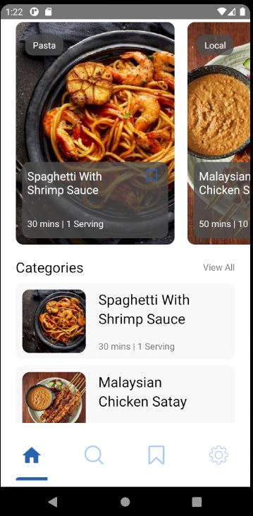

# Food Recipe app react-native

## Installation

Install the dependencies and start.

```sh
cd food-recipe-app-react-native
npm i
npx react-native start
npx react-native run-android
```

## Run Project

```sh
npx react-native start
npx react-native run-android
```
## Run Project





